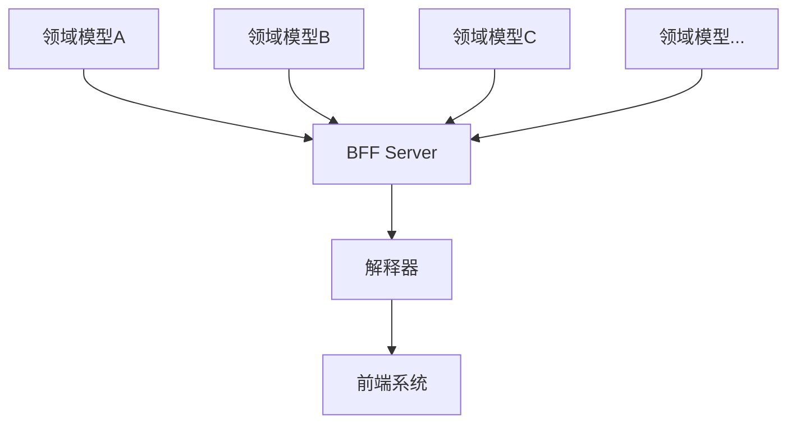

# 技术选型与架构设计


## 01. 框架名称 - elpis {#two-one}

`elpis` 是一款 中后台建站 系统，全栈全流程开发一个多网站建设的系统平台、能通过配置化去沉淀大部分的重复需求、并且提供各种各样的定制化能力，可灵活支持20%的定制化需求开发。


## 02. 业界方案调研 {#two-two}

### 2.1 其他方案 {#two-two-one}

- 方案A：大而全的触达系统，标准化流程。（行业参考：神策，易观）

- 方案A问题：
  1. 不适合多客户交付场景
  2. 交付时冗余过多无用能力
  3. 定制化拓展能力弱，往往牺牲客户需求。
  4. 跟随迭代，熵增明显。


- 方案B：多个子系统配合，灵活配置各个运营场景。

- 方案B问题：
  1. 不适合外部客户私有化交付场景
  2. 通用建站能力不适用于领域性较强的场景
  3. 过分灵活，搭建复杂，并无实质性提效
  4. 未能体系化解决触达领域问题


### 2.2 折中解决方案 {#two-two-two}

1. 粒度：算子服务

   将业务逻辑拆解为最小可复用的“算子”（Operator），通过编排组合实现复杂功能，适用于高内聚、低耦合的微服务或 Serverless 架构。

2. AOP 领域建模

   通过切面（Aspect）解耦横切关注点（如日志、事务、权限），保持领域模型的纯粹性。

3. 面向对象建站

   用面向对象思想设计网站架构，强调类、继承、多态的灵活运用。


## 03. 项目框架设计 {#two-three}


项目框架设计分为 数据层 BFF层 展示层

| 数据层   | BFF层  | 展示层        |
| :------- | :----- | :------------ |
| 数据库   | 接入层 | 单页面CSR-SPA |
| 缓存     | 业务层 | 多页面SSR-MPA |
| 文件存储 | 服务层 | 框架层工程化  |
| 日志     |        | 接口请求      |
| 外部服务 |        |               |


## 04. 技术选型（vue3 + nodejs）{#two-four}

### 4.1 数据层 {#two-four-one}

- MySQL 数据库	（适配性）
- Log4js 日志             （企业规模 真实开发场景 社区资源丰富）


### 4.2 BFF层 {#two-four-two}

BFF层 用 koa 来做 nodejs 的服务框架  结合 Egg  用 koa 搭建小型的 Egg 引擎

- Nodejs18		  （语言接近Js）
- Koa2


### 4.3 展示层 {#two-four-three}

- Vue3
- webpack5                 （对工程化的理解更为全面）
- element-plus              (更为主流)

每选择一个技术栈都有对应的原因，生态、社区、适配性、未来的发展


## 05. 服务端 BFF 设计 {#two-five}

### 5.1 BFF简介 {#two-five-one}

[BFF](https://zhida.zhihu.com/search?content_id=194642125&content_type=Answer&match_order=1&q=BFF&zhida_source=entity)（Backend for Frontend）层，主要就是就是为了前端服务的后端。与其说是后端，不如说是各种端（Browser、APP、miniprogram）和后端各种[微服务](https://zhida.zhihu.com/search?content_id=194642125&content_type=Answer&match_order=1&q=微服务&zhida_source=entity)、[API](https://zhida.zhihu.com/search?content_id=194642125&content_type=Answer&match_order=1&q=API&zhida_source=entity)之间的一层胶水代码。这层代码主要的业务场景也比较集中，大多数是请求转发、数据组织、接口适配、权鉴和SSR。

在这种业务场景下，采用大前端的开发模式，会提升业务的迭代效率。

1、前端和后端都使用JavasScript，技术栈是统一的。从写代码，到编译、打包、脚手架、组件化、包管理，再到[CICD](https://zhida.zhihu.com/search?content_id=194642125&content_type=Answer&match_order=1&q=CICD&zhida_source=entity)，采用同一套都不是问题。

2、Client Side JavaScript和Server Side JavaScript本身就有很多可服用的代码，例如现在行业里有很多同构代码的[CSR](https://zhida.zhihu.com/search?content_id=194642125&content_type=Answer&match_order=1&q=CSR&zhida_source=entity)和SSR解决方案。

3、优化研发组织结构。大前端的开发模式，让接口定义、接口联调、环境模拟等，原来需要两种不同技术能力栈的工程师互相协作的模式，变为同一种技术技术能力栈的工程师独立完成的模式，让沟通和推动的成本降到最低。


### 5.2 BFF设计 {#two-five-two}

```
		接入层	-- router接口路由分发 router-schema路由规则 middleware路由中间件


BFF层	业务层-- controller处理器 env环境分发 config提取 extend服务拓展 schedule定时服务


		服务层 -- service处理器
```

从上图可知整个请求的流向

从路由 → 中间件的前置处理  → 业务controller的处理  → 服务层的处理  → 中间件的后置处理  → 返回结果

无论是页面请求还是 api 的请求 这套流程同样适用


### 5.3 BFF优势 {#two-five-three}

通过上面的的各种问题和场景，相信我们已经知道了BFF可以解决很多场景的问题，这里总结一下BFF的优势：

1. 服务端对数据展示服务进行解耦，展示服务由独立的BFF端提供，服务端可以聚焦于业务处理。
2. 多端展示或者多业务展示时，对与数据获取有更好的灵活性，避免数据冗余造成消耗服务端资源。
3. 对于复杂的前端展示，将数据获取和组装的负责逻辑在BFF端执行，降低前端处理的复杂度，提高前端页面响应效率。
4. 部分展示业务，可以抽象出来利用BFF实现，对于服务端实现接口复用。
5. 降低多端业务的耦合性，避免不同端业务开发互相影响。
6. 其他优势，包括数据缓存，接口安全校验等。


## 06. 前端 领域模型 架构设计 {#two-six}

通过一套统一的 DSL （Domain-Specific Language，领域特定语言） 描述出整个系统的具体结构

定义一个 DSL 来描述领域模型的项目

实现一个 根据 DSL 能动态生成具体系统 的解析引擎




